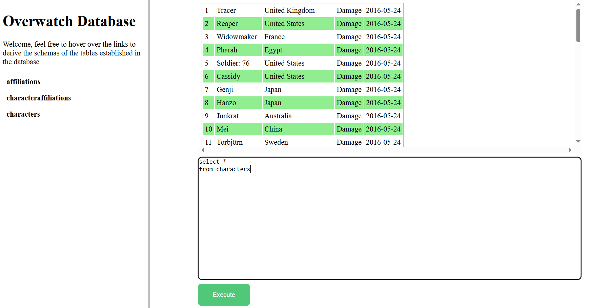

# MySQL Database
This web app connects to a local database made using MySQL WorkBench filled generates tables for the user to query revelent information regardng the characters.

Note that this app only allows SQL SELECT statements to avoid modifying origonal database.

</img>

Also note that in this example I use a local database I made of characters from a videogame I play called Overwatch.

## Installation
Assuming python is installed, install the following modules:
```
pip install flask
pip install flask_socketio
pip install mysql-connector-python
```
After creating a MySQL Wrokbench database connect it by creating a .env with the following information:
```
MYSQL_USERNAME = WOUR_USERNAME
MYSQL_HOST = YOUR_HOST
MYSQL_PASSWORD = YOUR_PASSWORD
MYSQL_PORT = YOUR_PORT
MYSQL_DATABASE = YOUR_DATABASE
```
Replace YOUR_* fields with the relevant info from your MySQL Workbench

## Running the app

To use the app, locate app.py in the flask-app directory and run it.

The app is programmed to run on an automatically opened new window at http://127.0.0.1:5000 as defined app.py:
```
if __name__ == '__main__':
    socketio.run(app, host="127.0.0.1", port=5000)
    webbrowser.open_new(f'http://127.0.0.1:5000/')
```
If you wish to change the host or port of the web app I would do so here.

Closing the web browser connecterd to the app closes the app as well.